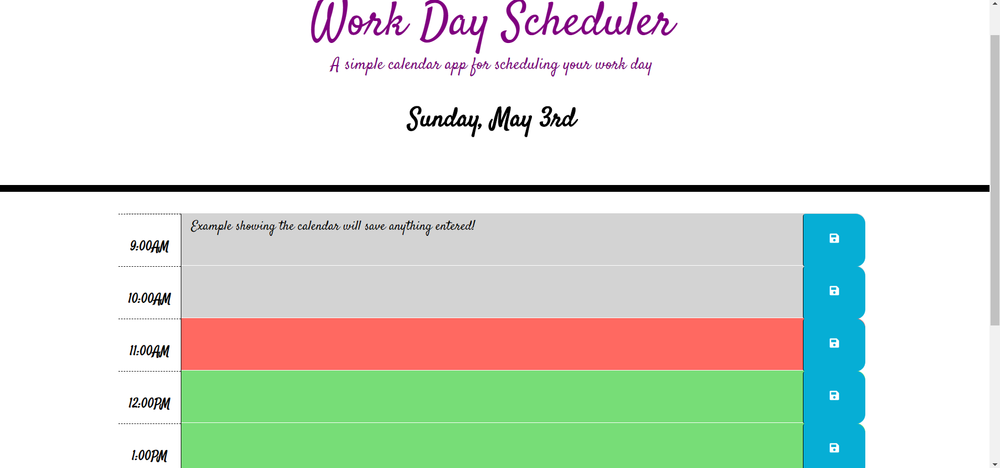

# Work Day Scheduler

## Description

AS AN employee with a busy schedule
I WANT to add important events to a daily planner
SO THAT I can manage my time effectively

In order to practice third party APIs, a calendar app was designed using HTML, CSS, Javascript, and JQuery skills. When launching the calendar app, the user will see the current date listed at the top, and underneath they will see time blocks for hours of the day between 9AM - 5PM. Inside this calendar app the user is able to successfully add events to the calendar between these times, and save them. If the user were to close the app and reopen, they would see that their events added to the calendar are still listed. The calendar will also display different colors in the time blocks to represent past (gray), present (red), and future(green). This helps the user determine what time it currently is, what events have passed, and what events await.

## Usage
Below you will find a shot of what the calendar app looks like. In this example, the time is 11AM which is red, and displays the past times as gray and the future times as green. 

## Installation
To use the calendar app to help keep track of events you need to remember, click the link here:
https://shannontrainor.github.io/work-day-scheduler/

### Credits
Bootstrap https://getbootstrap.com/
Font Awesome https://fontawesome.com/
Google Fonts https://fonts.google.com/